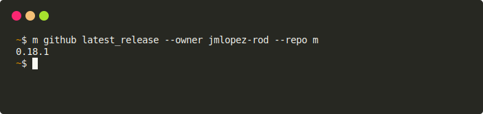

# m github latest_release

Obtain the latest release for the project.



## Bash example

Can be used along other `m` cli commands to store the latest version in a
variable.

```shell
owner=$(m jsonq @m/m.json owner)
repo=$(m jsonq @m/m.json repo)
currentVersion=$(m github latest_release --owner "$owner" --repo "$repo")
```

## Options

### --owner

- Default: `env.GITHUB_REPOSITORY_OWNER`.

The Github user or organization that owns the repository.

### --repo

The name of the repository.
